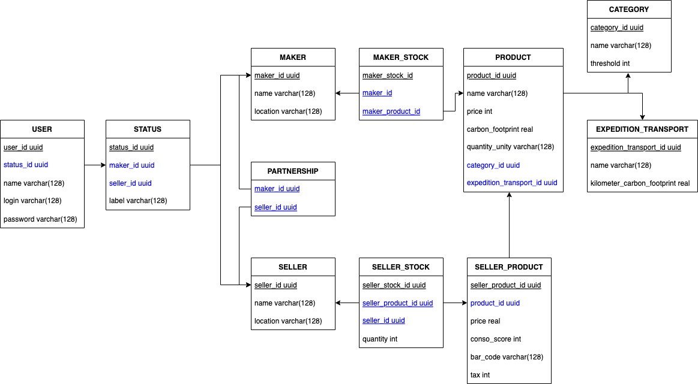

# conso-score-bdd

This repository contains the SQL scripts used to create the conso-score database.

## File structure

- `/database` contains the sql and bash scripts to create the database
- `/doc` contains documentation

At the root of this project, you can find a docker-compose.

## Deploy the database

Go to the root of the project, and input `docker-compose up` in a terminal.

Docker must be installed.

## Database scheme

Legend:

- A box is a table
- Fields are represented as follow: `<field name> <type>`
- Underscored field are primary keys
- Blue colored field are foreign keys

## Tables

This section describes all tables and their fields.

### User

| Field     | Type         | Description                  |
| --------- | ------------ | ---------------------------- |
| user_id   | uuid         | ID of the user               |
| status_id | uuid         | ID of the status of the user |
| name      | varchar(128) | Name of the user             |
| login     | varchar(128) | Login of the user            |
| password  | varchar(128) | Password of the user         |

User table holds data of the user, mainly used to log in the user in the system.

### Status

| Field     | Type         | Description                                              |
| --------- | ------------ | -------------------------------------------------------- |
| status_id | uuid         | ID of the status of the user                             |
| maker_id  | uuid         | ID of the maker if the user is a maker, null otherwise   |
| seller_id | uuid         | ID of the seller if the user is a seller, null otherwise |
| label     | varchar(128) | MAKER or SELLER                                          |

Status table describes the status of users. A user can either be a MAKER or a SELLER.

### Maker

| Field    | Type         | Description           |
| -------- | ------------ | --------------------- |
| maker_id | uuid         | ID of the maker.      |
| name     | varchar(128) | Name of the maker     |
| location | varchar(128) | Location of the maker |

Maker describes a maker an its location. A maker is an entity such as a company which produces food.

### Seller

| Field     | Type         | Description            |
| --------- | ------------ | ---------------------- |
| seller_id | uuid         | ID of the seller       |
| name      | varchar(128) | Name of the seller     |
| location  | varchar(128) | Location of the seller |

Seller describes a seller and its location. A seller is an entity such as a company which sells food.

### Partnership

| Field     | Type | Description      |
| --------- | ---- | ---------------- |
| seller_id | uuid | ID of the seller |
| maker_id  | uuid | ID of the maker. |

Partnership represents the association between a Seller and a Maker.

### Maker stock

| Field            | Type | Description                  |
| ---------------- | ---- | ---------------------------- |
| maker_stock_id   | uuid | ID of the maker's stock      |
| maker_id         | uuid | ID of the maker              |
| maker_product_id | uuid | ID of a product of the maker |

Maker stock holds the stock of products of the maker.

### Product

| Field                   | Type         | Description                                                      |
| ----------------------- | ------------ | ---------------------------------------------------------------- |
| product_id              | uuid         | ID of a product                                                  |
| name                    | varchar(128) | Name of the product                                              |
| price                   | int          | Price of the product, it is the maker price                      |
| carbon_footprint        | real         | The carbon footprint of the maker product                        |
| quantity_unity          | varchar(128) | Unit of the product like kg or L                                 |
| category_id             | uuid         | Id of the category that the product belongs to                   |
| expedition_transport_id | uuid         | Id of the expedition transport of the product like boat or truck |

Product describes a product stored in the maker stock. The `price` represents the price of sell to the seller, and the `carbon_footprint` represents the carbon footprint of the product from the maker side.

### Seller stock

| Field            | Type | Description                    |
| ---------------- | ---- | ------------------------------ |
| seller_stock_id  | uuid | ID of seller's stock           |
| seller_poduct_id | uuid | ID of a product from the stock |
| seller_id        | uuid | ID of the seller               |
| quantity         | int  | quantity of the product        |

Seller stock holds the stock of seller products

### Seller product

| Field             | Type | Description                                    |
| ----------------- | ---- | ---------------------------------------------- |
| seller_product_id | uuid | ID of the seller product                       |
| product_id        | uuid | ID of the correspondind product from the maker |
| price             | real | price of the product                           |
| conso_score       | int  | The conso score of the product                 |
| bar_code          | int  | Bar code of the product                        |
| tax               | int  | Tax associated to the product in %             |

Seller product represents a product stored in the seller stock. It embbed additionnal information over the original product. The `price` is the price of the product with the `tax` added.

### Category

| Field       | Type         | Description                          |
| ----------- | ------------ | ------------------------------------ |
| category_id | uuid         | ID of the category                   |
| name        | varchar(128) | Name of the category                 |
| threshold   | int          | Threshold when a tax will be applied |

Category represents different categories of products such as meat or vegetables. Each category detains a treshold in order to adapt taxes to each category.

### Expedition transport

| Field                      | Type         | Description                                        |
| -------------------------- | ------------ | -------------------------------------------------- |
| expedition_transport_id    | uuid         | ID of the transport                                |
| name                       | varchar(128) | Name of the transport                              |
| kilometer_carbon_footpring | real         | The carbon footprint by kilometer of the transport |

Expedition transport represents the means of transport of the product from the maker to the seller.
